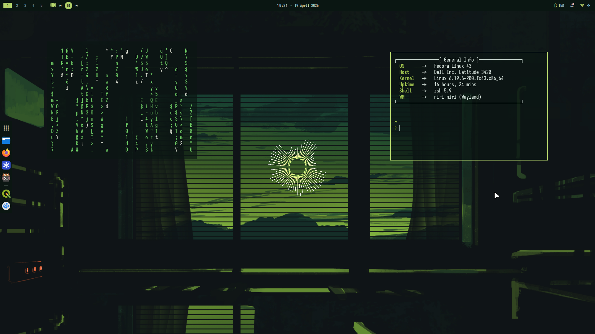

# niri-dots
Dotfiles baru buat laptop utama.
Ini setup Niri + Dank Material Shell yang baru aja aku coba.
Skema warna sistem berubah sesuai wallpaper yang digunakan menggunakan matugen.

## Galeri

## Credits

- [Matugen themes](github.com/corecathx/matugen-themes-zed/)
- [Niri](https://github.com/YaLTeR/niri)
- [Quickshell](https://quickshell.org/)
- [DankMaterialShell](https://danklinux.com/)
